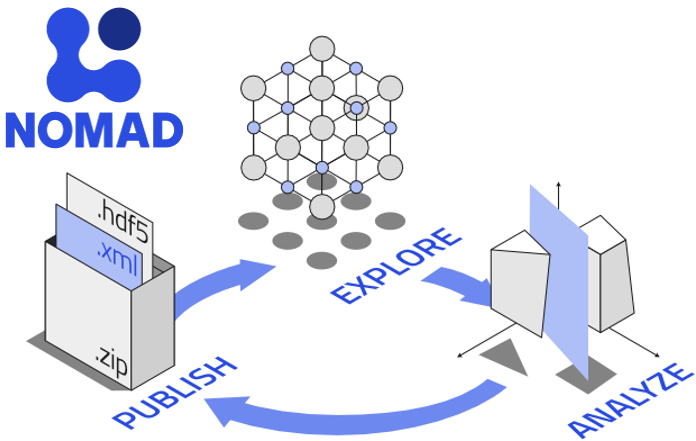
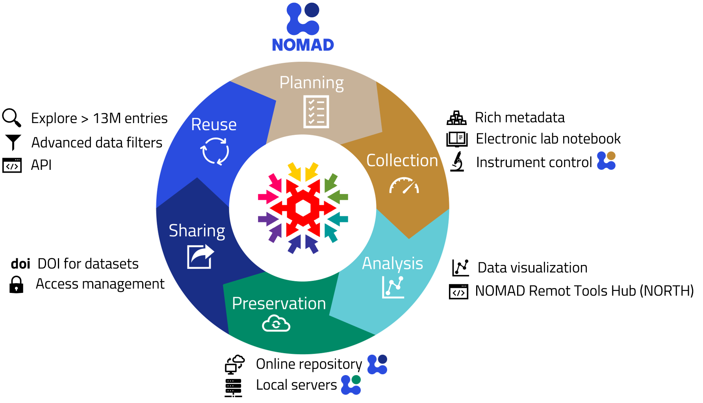

<!-- ## Research data management with NOMAD -->

# Research Data Management with NOMAD
## **Introduction to NOMAD: Facilitating FAIR Research Data Management in Materials Science**

Materials science researchers face a constant struggle: managing the vast amounts of data generated by their work.  That's where NOMAD comes in. 

NOMAD is a free, open-source data management platform designed specifically for materials science. Its core mission is to ensure that research data adheres to the FAIR principles: Findable, Accessible, Interoperable, and Reusable.

NOMAD goes beyond simple storage. It provides a comprehensive suite of tools for the entire research data lifecycle, including:

- **Data Management**: Structure and organize your data efficiently, ensuring clarity and ease of access.
- **Data Sharing**: Seamlessly collaborate with colleagues by sharing your data within a secure platform.
- **Data Publishing**: Publish your FAIR data for access and use by the wider scientific community.

By overcoming the challenge of heterogeneous and unfindable data, NOMAD empowers researchers on multiple levels. Individual scientists can streamline their data organization and analysis. Research groups gain a platform that facilitates collaboration and knowledge sharing.  Ultimately, NOMAD fosters the creation of a rich, centralized archive of FAIR research data for the benefit of the entire materials science community.

## **NOMAD supports the Research Data Lifecycle**

The data lifecycle refers to the journey data takes throughout its existence.  This journey typically involves several stages: first, data is generated or collected during research activities, during which the data and the corresponding processing or measurement conditions are documented. Next, the data is processed to ensure accuracy and usability and analysis is performed on the data to extract insights and knowledge.  Once analyzed, the data is stored securely for later access.  Data management tools are then used to organize and retrieve the data.  Finally, data can be shared with colleagues or the broader scientific community, fostering collaboration and reuse.  Following these steps helps ensure that valuable data is not lost or forgotten, but rather preserved and used to its full potential.

NOMAD goes beyond simple storage. It provides a comprehensive suite of tools that empower researchers throughout the research data lifecycle, including:

- **Planning:** NOMAD's tools can help plan how to effectively organize and manage data from the beginning of a project.

- **Collection:** NOMAD functions as an Electronic Lab Notebook (ELN) for structured data documentation. In addition, NOMAD provides connectivity to NOMAD CAMELS, a powerful instrument control tool that streamlines data collection by generating structured and FAIR data directly from instruments.

- **Analysis:** NOMAD empowers researchers with data analysis through the NOMAD Remote Tools Hub (NORTH) tool. NORTH provides a platform for data post-processing and analysis using custom scripts. For example, researchers can use Jupyter notebooks within the NORTH interface. This allows for flexible and powerful data exploration and analysis.

- **Preservation:** NOMAD prioritizes long-term data preservation. When using the centralized NOMAD infrastructure, your data is kept safe and secure. For researchers who prefer local control, NOMAD Oasis allows you to store your data on your own servers. This flexibility ensures that researchers can choose the data storage solution that best suits their needs.

- **Sharing:** NOMAD promotes secure data sharing with colleagues through its user management system. This allows researchers to control access to their data while facilitating collaboration. In addition, NOMAD improves data visibility and citation by enabling researchers to obtain Digital Object Identifiers (DOIs) for their data sets. DOIs ensure that data can be easily found and properly credited in publications.

- **Reuse:** NOMAD actively promotes the reuse of data. The platform stores data with rich metadata, enabling comprehensive search and exploration. NOMAD's exploration interface provides an easy-to-use GUI with a variety of filters based on this rich metadata. Researchers can easily find relevant records based on specific criteria. In addition, NOMAD provides a powerful API (Application Programming Interface) that allows programmatic access to the data. This enables researchers to automate data exploration and integration into their workflows, further facilitating reuse.

By addressing the challenge of heterogeneous and unfindable data, NOMAD empowers researchers on multiple levels. Individual scientists can streamline their data organization and analysis throughout the research lifecycle. Research groups gain a platform that facilitates collaboration and knowledge sharing at every stage.  Ultimately, NOMAD fosters the creation of a rich, centralized archive of FAIR research data for the benefit of the entire materials science community.