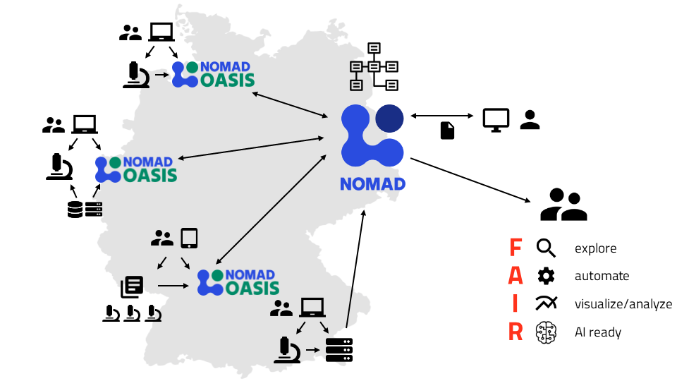

# Towards Building a Federated FAIR Data Infrastructure with NOMAD and NOMAD Oasis

## NOMAD

    

NOMAD is a free, open-source web-based software designed for managing, sharing, and publishing materials science data. It provides a comprehensive suite of tools to help researchers organize, analyze, and publish their data.

NOMAD's data are organized in well-defined structures described by a formal schema known as the NOMAD Metainfo. This schema ensures that data are hierarchically structured and cross-referenced, enabling efficient searching, accessibility via APIs, interoperability, and reusability.

NOMAD's data are organized in well-defined structures described by a formal schema known as the NOMAD Metainfo. This schema ensures that data are hierarchically structured and cross-referenced, enabling efficient searching, and accessibility via APIs, interoperability, and reusability.

    

NOMAD offers important features for effective research data management including:

- **FAIR Data**: RDM with NOMAD ensures data are Findable, Accessible, Interoperable, and Reusable by extracting machine-actionable data from over 60 formats and codes. With NOMAD you can provide rich and organized metadata for custom theoretical and experimental research data. 
- **Organizing in Hierarchical Format**: NOMAD organizes your files as you would on your hard drive, allowing for file-by-file or batch uploads using drag and drop. All data are hierarchically structured and interconnected. NOMAD uses a file-based archival system, meaning that you access all your raw files, in case a migration or archival in other data management systems are desired.
- **API Access**: NOMAD allows you to programmatically manage your research data. Everything you might need for an effective research data management is accessible via API, including raw files, data, metadata, processed data, etc.
- **Extensible Schema**: With NOMAD, you have highest flexibility for your RDM needs. The existing NOMAD schema can be extended to suit your specific needs.
- **Practical User Control**: Using NOMAD, you can manage your data privately or collaborate within your group before making it public. For even higher privacy, e.g., due to restrictions within an institute or research group, NOMAD has further solutions, the NOMAD Oasis.  
- **Integrated Analysis Tools**: NOMAD offers a programming environment for your advanced analysis processes and visualizations, e.g., you can run Jupyter notebooks and other tools directly on NOMAD. Access and modify your data, and publish your Jupyter notebooks.
- **DOI Assignment**: With NOMAD, you can publish and archive your data for free, with the ability to assign DOIs to datasets for easy referencing in publications.
- **Comprehensive Database**: NOMAD Combines data from popular sources like the Materials Project, AFLOW, and OQMD, making it the largest database of its kind.

## NOMAD Oasis

    

The central (or public) NOMAD uses computer resources from the Max-Planck-Society. For specific needs where more resources or greater privacy are required, NOMAD Oasis is the solution. NOMAD Oasis is containerized. You can run it on a single computer with Docker Compose or on a large cluster with Kubernetes. NOMAD can be used to manage data for small groups as well as large research institutes, allowing to manage data under your own rules and extensions.

NOMAD Oasis lets you create your own local NOMAD instance, providing all the features of the public NOMAD service while allowing you to implement your specific data management needs and policies. With NOMAD Oasis, you get an instant overview of all your group's data, increase productivity, and realize your research data management plans with ease.

    

NOMAD Oasis allows you to manage your data locally, while still being prepared to publish and share your data via NOMAD.

Most important features of NOMAD Oasis include:

- **Easy Installation and Scalability**: Install with a simple guide on any computer with Docker, and utilize unlimited scalability on Kubernetes clusters when needed.
- **Local Operation**: NOMAD Oasis can be customized to operate behind your firewall and inside your VPN.
- **Control over Published Data**: NOMAD Oasis allows managing data without publishing them. Soon, NOMAD Oasis will be connected to the public NOMAD service, allowing you to publish selected data with one click.
- **Custom ELNs**: Extend and customize NOMAD's schema to create specialized ELNs for documenting your work and data.
- **Easy Backup**: All data are organized in a conventional file system, easily integrated into existing storage and backup solutions. You can export all the files related to your projects, or publish them using the central NOMAD service.

## Achieving a Federated FAIR Data Infrastructure

Combining NOMAD and NOMAD Oasis allows for the creation of a federated FAIR data infrastructure. This setup enables local control and customization while still benefiting from the centralized, comprehensive features of the public NOMAD.

Research institutions can manage sensitive data locally with NOMAD Oasis and selectively share and publish data to NOMAD. By leveraging both platforms, research groups can achieve a robust, scalable, and secure data management environment that supports collaboration, data sharing, and advanced analysis, all while adhering to the highest standards of data stewardship.

