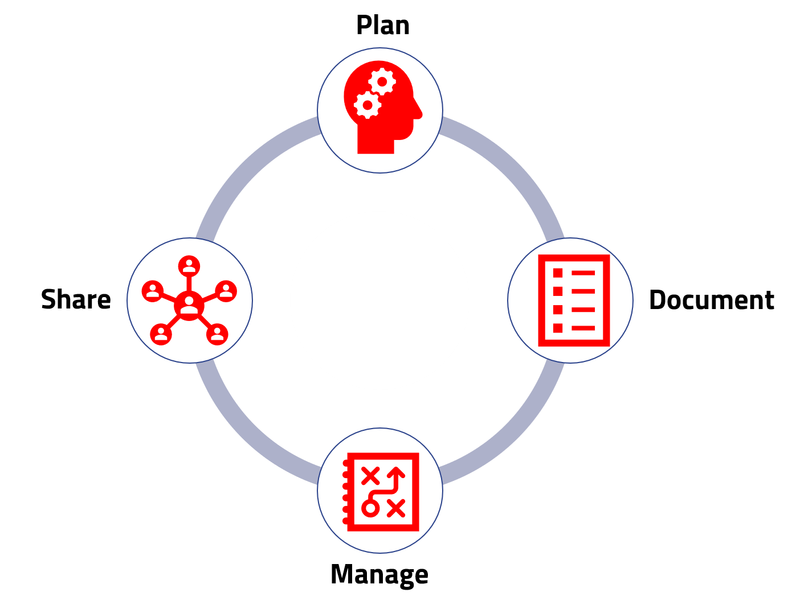

<!-- ## Creating an Electronic Lab Notebook using NOMAD built-in ELN schema -->

# Overview
## **Introduction**
Setting up scientific experiments involves a series of interrelated steps: planning, documenting, managing, and sharing. Each phase relies on the others to form a cohesive process that ultimately contributes to the success of your research efforts.

First, you need to plan what you're going to do. This means thinking ahead about what resources you will need and deciding on the best way to conduct your experiment.

Next, you need to write things down as you go. This includes recording what you use, what you prepare, and what you do. In addition to any results you get. It's like keeping a diary of your experiment.

Then you need to keep everything organized. This means keeping your notes, data, and materials in order so that you can easily find what you need when you need it.

Finally, it is really important to share your progress and findings with others. This means keeping your collaborators up to date on your latest experiments, and allowing them to record the experiments they have also performed. 

Each part of this process is important because it helps the next step go smoothly. By following these steps, you will set yourself up for success in your research endeavors.

In this module, we will show you how to use NOMAD's ELN functionality to record your experiments and effectively manage your researchd data, from planning, documentation, management, and sharing your experiments in the lab.

| [Previous] | Introduction | [[Next]](5_01_Overview_plan.md)
|------------|-----------|-------|
