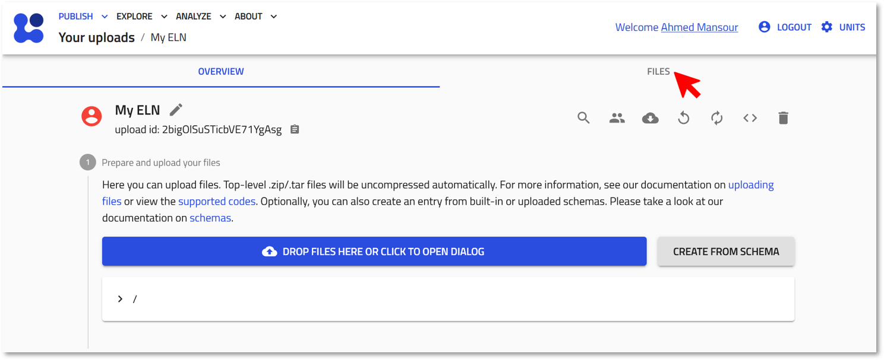
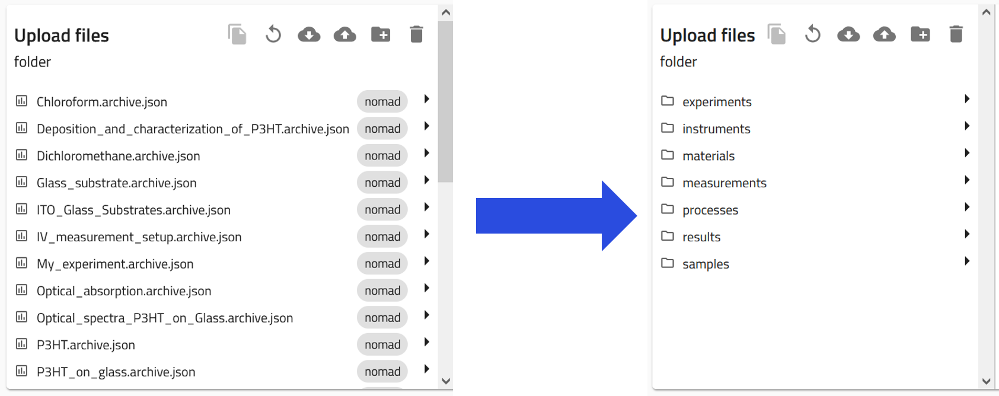
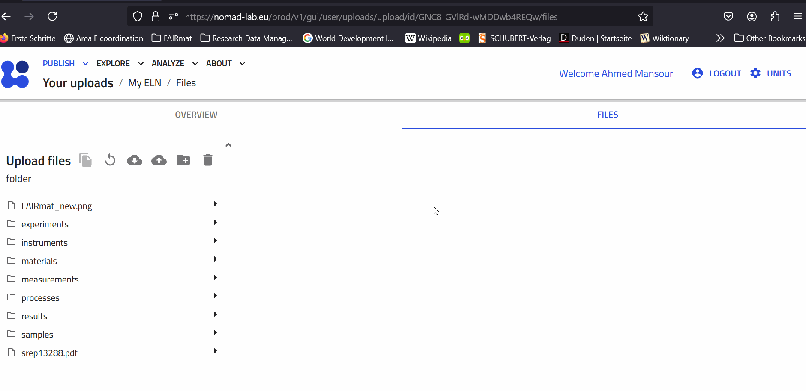

# Organizing Your Upload

NOMAD is a file-based system. This means that the data and information within NOMAD are primarily stored, managed, and accessed in the form of files. This approach contrasts with systems that might rely heavily on databases for data storage.

In the context of NOMAD as an ELN, being a file-based system means that all the experimental data, schemas, and configurations are stored as files, which you can manage directly. This can make it easier to integrate with other tools, create local backups, and share data across different platforms.

In this section, you will learn how to view and manage files within NOMAD. We’ll cover navigating the file structure, organizing entries into folders, and uploading or downloading files for better data management and backup.

## Accessing Your Files in NOMAD
To access your files in an upload, simply navigate to the *File* tab at the top of the upload page. 

This will open a page that functions similarly to the file explorer on your computer, displaying all files associated with your upload, whether they have been processed by NOMAD or not.

In essence, this page acts as your online storage drive for the uploaded content in NOMAD.

You can organize your files by creating folders, upload additional items like images or PDFs, and even download the entire directory to your local computer for offline access.

Note that changing the folders structre will not affect the view or the function of the entries on **Overview** page. 

## Organizing Your Entries into Folders

Let's organize the entries into folders of materials, samples, instruments, processes, results, and measurements. 

### **Create New folders**
You can create a new folder by clicking on the folder icon shown on the top.

Then choose a name for your folder and click OK.

### **Move Your Entries to the Relevant Folder**

Click on the folder to which you want to transfer entries to. A second panel will open to show the contents of the folder, which should be empty by now.  
You can drag-and-drop the entry files into the relevant folder. A prompt will appear asking if you want to copy or move the folder. Select *move*. 

## Adding Files to Your Upload

Being a file-based system, NOMAD allows you to upload documents and images to your upload. 

To add files to your upload, click on the upload cloud icon shown at the top.

For example, you can add relevant publications and images to your upload and share them with your collaborators, in a similar manner to online shared drives.

## Backing Up Your Upload

NOMAD allows you to download the entire upload folder to your local machine. To do so, click on the download cloud icon on the top. 

All the contents of your upload will be downloaded as a zip file to your computer.

